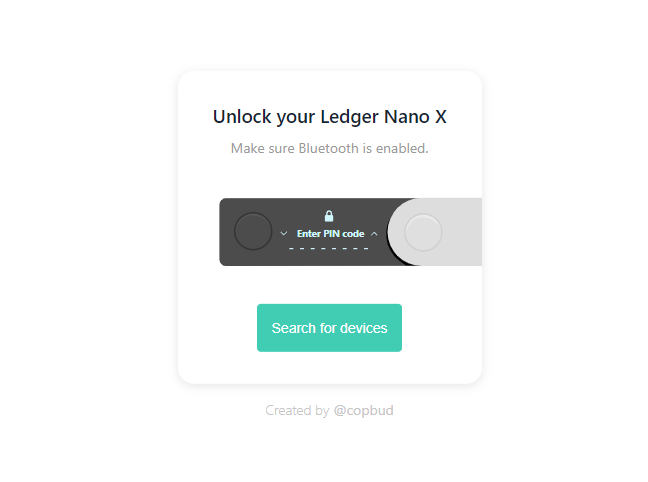

# Ledger Nano X Bluetooth Bridge
Allows you to (finally) use your Ledger Nano X with Metamask via Bluetooth!

## Demo
https://i.imgur.com/IrbQi8C.gif

## Installation
 - Install the extension:
 - - Either by loading the extension unpacked, via the extensions tab (remember to enable developer mode).
 - - Or by downloading from the [Google Web Store](https://chrome.google.com/webstore/detail/COMING/SOON) (coming soon).
 - Reload Metamask (turn off and back on), through the [extensions tab](chrome://extensions/?id=nkbihfbeogaeaoehlefnkodbefgpgknn).
 - Enable Ledger Live integration in Metamask settings
 - - Click on your accounts (the top right image)
 - - Settings
 - - Advanced
 - - Scroll down to, and turn on Ledger Live
 
## Usage
Simply do a transaction and the connection tab will open. This will ask you to connect your Ledger via Web BLE.

**This means the tab must stay open, for the connection to stay open.**

If something doesn't work, your best bet is to refresh first the extension, then Metamask.

## Troubleshooting
On Windows, you may have to pair the device with your computer before its able to connect.
Simply do this in the Windows settings, confirm the pairing code on your Ledger, then you should be able to connect in the connection tab again.

## Disclaimer
This may be buggy, and it should just be taken and used as a proof of concept.
I take no responsibilities for anything that may, or may not happen.
